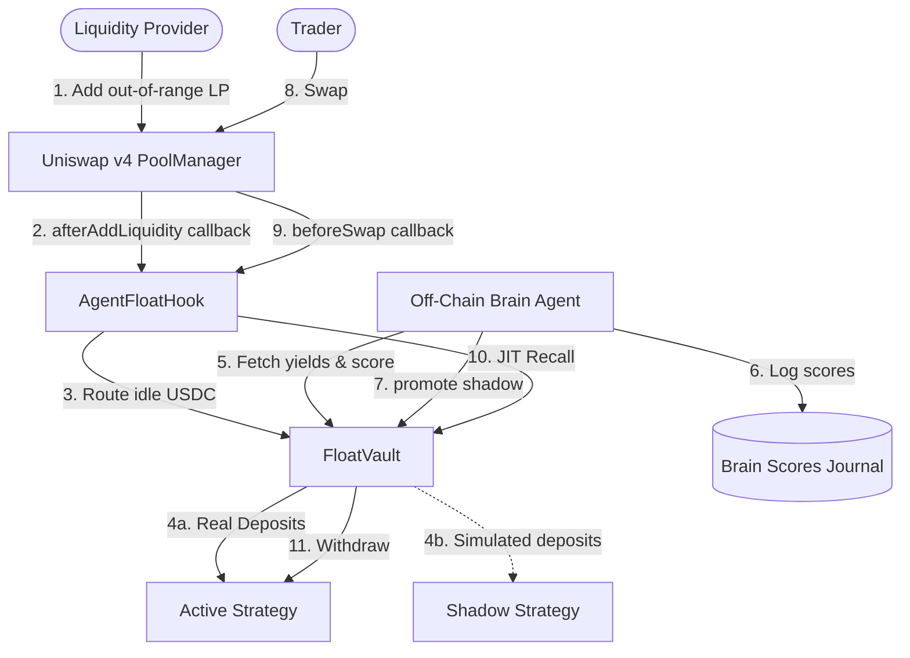

# AgentFloat — Architecture & Data Flow

AgentFloat is a Uniswap v4 hook and strategy-registry vault system deployed on the X Layer testnet. It automates yield routing for idle, out-of-range Liquidity Provider (LP) capital, while running on-chain simulations of alternative shadow strategies that can be autonomously promoted by an off-chain brain agent.

---

## System Overview

---

## Component Details

### 1. `AgentFloatHook.sol` (Uniswap v4 Hook)
Intercepts pool operations via targeted callback functions:
- **`afterAddLiquidity`**: Queries the pool's `slot0` state. If the added position's tick range does not cover the current price tick, the LP capital is determined to be idle. The hook pulls the idle USDC from the user/router and deposits it into `FloatVault` to generate yield.
- **`beforeSwap`**: Implements Just-In-Time (JIT) recall. When a swap indicates the price is moving back toward the out-of-range liquidity positions, the hook withdraws the parked capital from the vault and approves the PoolManager to use it to settle the LP position's pool obligations.

### 2. `FloatVault.sol` (Yield Vault & Strategy Registry)
Manages user deposits, active strategies, and simulated shadow registries:
- **Deposits Routing**: Raw capital is held in the `activeStrategyId`.
- **Shadow Performance Registry**: Simulates capital performance for alternative strategies (`isShadow = true`) without deploying real assets.
- **`postScore`**: An owner/promoter-gated endpoint where the brain agent logs performance scores.
- **`promote`**: Withdraws all funds from the current active strategy, deposits them into the promoted shadow strategy, and updates the active strategy configuration.

### 3. Off-Chain Brain Agent
A TypeScript service that runs watcher, scorer, and promoter loops:
- **Watcher**: Monitors Vault events (`Parked`, `Withdrawn`, `ScoreUpdated`, `StrategyPromoted`) and checks block heights.
- **Scorer**: Queries strategy balances and contract values, computes the performance yield ratio (score), appends results to the local journal `~/brain/raw/agentfloat-strategy-scores.md`, and calls `postScore` on-chain.
- **Promoter**: Evaluates rolling performance. If a shadow strategy outperforms the active strategy by more than `MIN_DELTA_BPS` for `MIN_EPOCHS` consecutive blocks, the promoter executes the on-chain `promote(shadowId)` call.

---

## Core Invariant and Safety Features
1. **Access Control**: Strategy registration and promoter address configuration are owner-gated. Score updates and strategy promotion are promoter-gated.
2. **Standard ERC-20 Compatibility**: Uses SafeERC20 mappings to support USDC and handles allowance boundaries safely.
3. **NoOp Protection**: The hook does not claim swap deltas or return custom exchange pricing. Swaps run natively inside the PoolManager, mitigating reentrancy and NoOp rug-pull surfaces.
